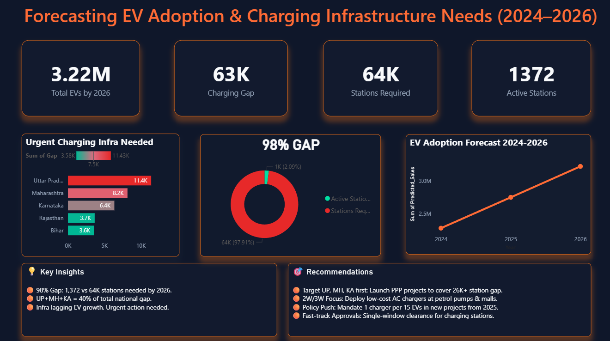

EV Infrastructure Gap Analysis 2026

Predicting the charging infrastructure gap for Electric Vehicles across Indian states by 2026.

📊 Project Overview

India's EV adoption is growing rapidly, but charging infrastructure is lagging. This project analyzes historical EV sales data from 2014-2024 and current charging station data to forecast the state-wise infrastructure gap for 2026. 

The goal is to help policymakers and investors identify high-priority regions for setting up new charging stations.

🎯 Problem Statement

As of 2024, the ratio of EVs to public charging stations in India is highly imbalanced. Without proactive planning, this gap will widen by 2026, creating bottlenecks for EV adoption in key states.

🛠️ Tech Stack

- LanguagePython 3.8+
- Libraries:Pandas, NumPy, Matplotlib
- IDE: Visual Studio Code
- Version Control:GitHub

🚀 How to Run

1.	Clone the repository
2.	Install dependencies
3. Add Dataset
   Place your EV_Dataset.csv in a Data/ folder in the root directory.
   Expected path: `Data/EV_Dataset.cs

3.	Run the analysis
cd Scripts
python day1.py
Python day2.py
Python day3.py

5. Check Results
   All outputs will be saved in the Outputs/folder.

📌 Important Note

The raw dataset EV_Dataset.csv is not included in this repository due to GitHub file size limits. To replicate this project, please add your dataset to Data/EV_Dataset.csv before running the scripts.

## 📊 Dashboard

Interactive analysis of state-wise EV growth vs charging station gap for 2026.

